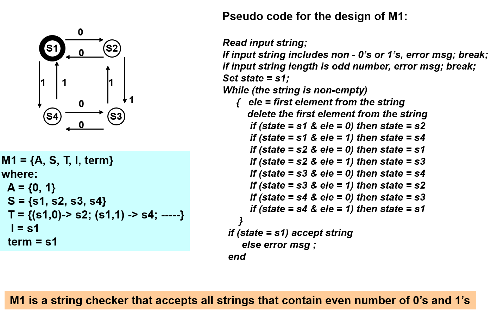

# Finite State Machine Demo

Finite state machine to that accepts an even number of 1's and 0's and checks
whether the final state is S1.

#  Usage

1. Install the latest dotnet framework, if necessary.
2. Execute `dotnet run` from the command line.

# Diagram
