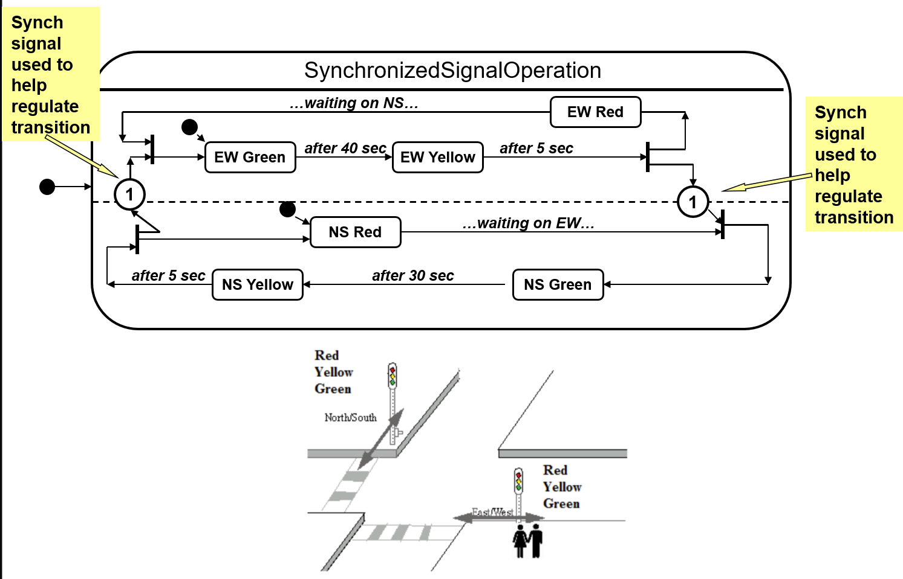
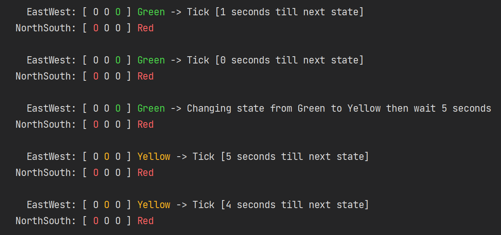

# Sync Multiple State Machines Demo

Synchronizes multiple state machines to simulate multiple traffic lights.
Synchronization is via a shared event that to which all state machines subscribe.

#  Usage

1. Install the latest dotnet framework, if necessary.
2. Execute `dotnet run` from the command line.

# Diagram

# Sample Output
