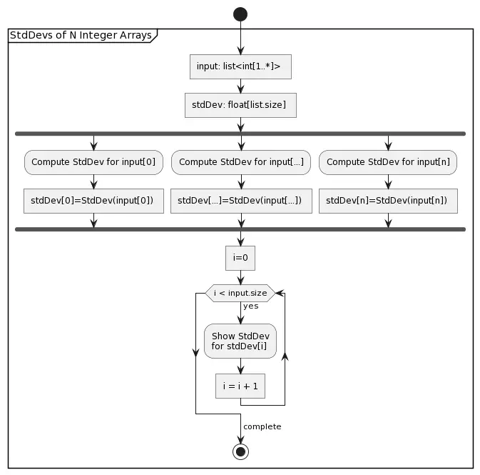

# Multi-threaded Standard Deviation Calculator

Generates random lists of integers and calculates the standard deviation of each list using 
multiple threads.

## To Execute

1. If needed, install the dotnet framework: https://dotnet.microsoft.com/download
2. Open a terminal.
3. Navigate to the StdDev project directory.
4. Execute the following command: `dotnet run`

## Sample Output

```text
Thread 2 finished in 7ms
Thread 3 finished in 8ms
Thread 1 finished in 19ms
Thread 7 finished in 25ms
Thread 6 finished in 32ms
Thread 8 finished in 37ms
Thread 4 finished in 50ms
Thread 5 finished in 52ms
Thread 9 finished in 55ms

All threads finished in 58ms

Standard Deviations for 9 Lists of Integers:
1) Elements:   190,790    StdDev:  12,116,243.877
2) Elements:     5,196    StdDev:  60,123,001.614
3) Elements:    35,673    StdDev: 212,130,078.320
4) Elements:   876,235    StdDev:  61,083,062.252
5) Elements:   817,607    StdDev: 479,193,458.847
6) Elements:   425,374    StdDev:  80,265,886.099
7) Elements:   298,239    StdDev: 224,877,771.677
8) Elements:   466,414    StdDev:  28,367,268.533
9) Elements:   814,898    StdDev: 115,124,334.962
```

## Activity Diagram

[](http://www.plantuml.com/plantuml/umla/dPA_Rjim48TtFiKXY-qMbkpDKU8WZbqKJjfqq902hWRQekLhn3yWJnRSekzUKNIPe1qAX8E6k----udWhIDkgP4r6wpqhf524IVKYWqEHCPbQMfghZoGxBHC-OxmY7GQbyWho-LuAuWpDlYYQbG2FfH8seRPRhHjs-JrU7IbPVVXQQwVdjThMIroMZMFTujxU_Vn-wULDCljydxxMJxWrvd9oyiZNSxC0qxNJxC9OtrYbg4o3MLGewDhLBIP9icxuWOAPhes-d-0YvpAbJWwq7juXBKYKGaB2slvoLt0JmRToLpFPB2lDQUDroKEVuW2YhwlD0cmM1qewmn847ZWtWAamSD-GP-dZzFFxRLzPd0-sLBBhYiW1FBDm6ycnTKB5THTRHwuuHzc14MK0gyuAlPVSv8aqHtLlXZb4NkBNlqhLt-fLHGBLRvSI8RpIIYt1wm5316kUscu-16WW-59k57qvmVTGb1_Kpx2UI6-oe0m1uJtC8qRU_kvFxxPQMbgGUAA_MAEj66tGlbN-1i0)

## PlantUML

[Click here to edit diagram in PlantUML.](http://www.plantuml.com/plantuml/umla/dPA_Rjim48TtFiKXY-qMbkpDKU8WZbqKJjfqq902hWRQekLhn3yWJnRSekzUKNIPe1qAX8E6k----udWhIDkgP4r6wpqhf524IVKYWqEHCPbQMfghZoGxBHC-OxmY7GQbyWho-LuAuWpDlYYQbG2FfH8seRPRhHjs-JrU7IbPVVXQQwVdjThMIroMZMFTujxU_Vn-wULDCljydxxMJxWrvd9oyiZNSxC0qxNJxC9OtrYbg4o3MLGewDhLBIP9icxuWOAPhes-d-0YvpAbJWwq7juXBKYKGaB2slvoLt0JmRToLpFPB2lDQUDroKEVuW2YhwlD0cmM1qewmn847ZWtWAamSD-GP-dZzFFxRLzPd0-sLBBhYiW1FBDm6ycnTKB5THTRHwuuHzc14MK0gyuAlPVSv8aqHtLlXZb4NkBNlqhLt-fLHGBLRvSI8RpIIYt1wm5316kUscu-16WW-59k57qvmVTGb1_Kpx2UI6-oe0m1uJtC8qRU_kvFxxPQMbgGUAA_MAEj66tGlbN-1i0)
