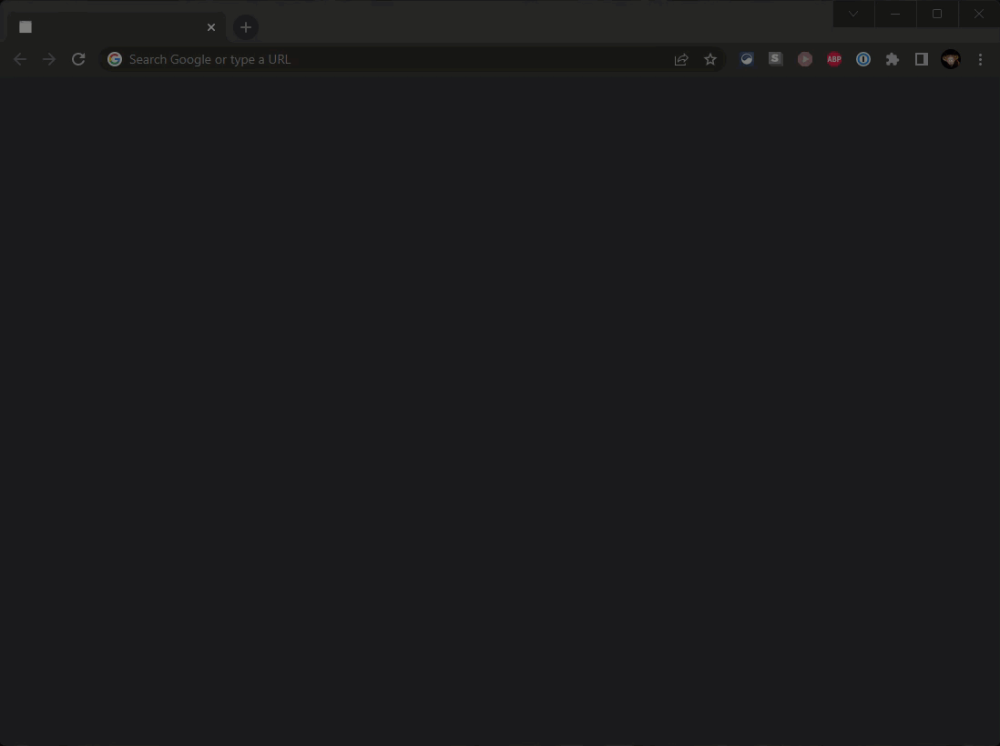

# SWE 1366 HONORS PROJECT
## MVC & State Machine Solution to Extract Emails From Text Blocks 

Create an MVC application that:
- accepts a multiline text block in a simple browser UI,
- posts the block to a controller,
- launches a state machine to detect simple email addresses in the block,
- returns the email addresses and their start indexes to the client, and
- renders the results in the browser.

## Valid Email Format

[alphanumericPlusDotAndDash]@[alphanumeric].[2-10 letters, alphanumeric]. 

### Valid Examples
1. Jeff-Adkisson@KSU.edu 
2. j.adkisson@KSU.edu
3. JeffAdkisson@KSU.university

## Invalid Examples
1. Jeff_Adkisson@KSU.com [underscore not allowed]
2. Jeff@KSU [top level domain is required]
3. Jeff@KSU.u [top level domain must be 2-10 letters, alphanumeric]
4. JeffAdkisson@KSU.universitymail [top level domain must be 2-10 letters, alphanumeric]
5. JeffAdkisson@K_S_U.university [underscore not allowed]

## Testing

The following regex matches these rules:

```regexp
\b([a-zA-Z0-9\\.-]+)@([a-zA-Z0-9]+)\.([a-zA-Z0-9]{2,10})\b
```

## Undetected Formats

This state machine does not detect multiple subdomains, such as Jeff@Kennesaw.State.edu.

## Steps

1. Create an MVC web application using your preferred language and framework. I suggest picking something that is easy to deploy because you also have to document how to set it up and that can be elaborate for some of the popular choices out there.
   - The home page will show a multiline input box labeled "Paste block of text"
   - Submit the text block to a controller that launches a state machine to detect whether the block of multiline text has an email address in it matching the format [alphanumericPlusDotAndDash]@[alphanumeric].[2-10 letters, alphanumeric]. For example, Jeff-Adkisson@KSU.edu and j.adkisson@KSU.edu and JeffAdkisson@KSU.university. Jeff_Adkisson@KSU.com is invalid as Jeff@KSU and Jeff@KSU.u.<br/><br/>
2. Implement the State Machine Pattern within the web application. You must implement the pattern from first principles. You cannot use a pre-made state machine library.
   - The state machine will be finite (https://en.wikipedia.org/wiki/Finite-state_machine).
   - The state machine will traverse through the submitted text block letter by letter, changing state as appropriate.
   - The state machine will return an array of found email addresses on termination (0 to *) along with their zero-based starting index. For example, if an email address is found at the start of the block, its starting index will be 0.
   - Here is an example in JavaScript I wrote in grad school for Theory of Automation that does text matching. https://jadkisson.github.io/dfa/ You do not need to build a sophisticated UI (though that is awesome and makes for a great demo).<br/><br/>
3. When the state machine has finished finding the email addresses, if any, return the results to the browser and render the findings. The results include the starting index of each email address and the email address. Also include a button to start a fresh search. For example:
   * Found 2 Email Addresses:
     1. Jeff-Adkisson@KSU.edu, 0
     2. j.adkisson@KSU.edu, 99<br/><br/> 
      [Search Another?]

--------------------

## Requirements

1. Build a small MVC server to host your state machine and produce a simple UI to submit a block of multiline text from a browser to a controller. You can use an existing server framework and language of your choice. Choose carefully - some are more involved than others both to implement and to configure/deploy.

2. The controller will start a state machine whose final state returns the email addresses (if any) found in the text block. A matching email address follows this format: [alphanumericPlusDotAndDash]@[alphanumeric].[2-10 letters, alphanumeric].

3. The text block can be between 0 and N characters and may have line breaks and other symbols in it. For example, I might pass in a block of code that contains an email address in it.

4. You CANNOT use a regex or other text-matching function in the state machine. Detection is letter by letter only. The only place you can use those techniques is in unit tests (if you make them, recommended, not required) to test your work.

5. The state machine will traverse the block of text letter by letter. Anytime an email address is found, record the entire address and the start index of the address.

6. After the state machine has finished, return the array of found addresses to the browser. List the number found and their start index in the block.

7. Post your solution to a public GitHub repo.

8. Your solution must include a README.md that includes how to setup and execute the project, example output, and a brief description of what it does. If your MVC requires an elaborate configuration, you must document that (I have to be able to run it). Note that I recommend picking a server application that is easy to deploy for this reason.

9. All code must be well written, well organized (think cohesion, coupling, cyclomatic complexity, readable, etc.) and professional grade. Comment as appropriate.

10. This project will be performed individually - not in teams.

--------------------
## Rubric

1. Was the MVC pattern properly implemented on the server? 10%

2. Does the UI accept a multiline block of text? 5%

3. Does the UI show all of the email addresses found and their starting index? 10%

4. Does the state machine find valid email addresses and ignore all else? 50%

5. Was the code quality professional grade? 5%

6. Was the project documented in the README.md? 10%

7. Was the code easily executed from a GitHub repo? 10%

--------------------
## Passing Score

1. Every line of the rubric must receive a score greater than 0%, and
2. You must have a total of 80% or higher for a passing score.

--------------------
## Assistance

This is an honors project and therefore will require you to work out the solution on your own. I can clarify requirements or review specific issues you might have, but I cannot provide coding assistance. The topics covered in this project are covered in some form later in the semester. I do not advise waiting for that. Also, this project goes deeper than the course will on state machines, so you might need to do some research.

-------

## Example Solution

Review the `StateMachine.MVC` project. The `README.md` file in that folder explains how to execute the project.



!](demo-mvc.gif)

--------------------
