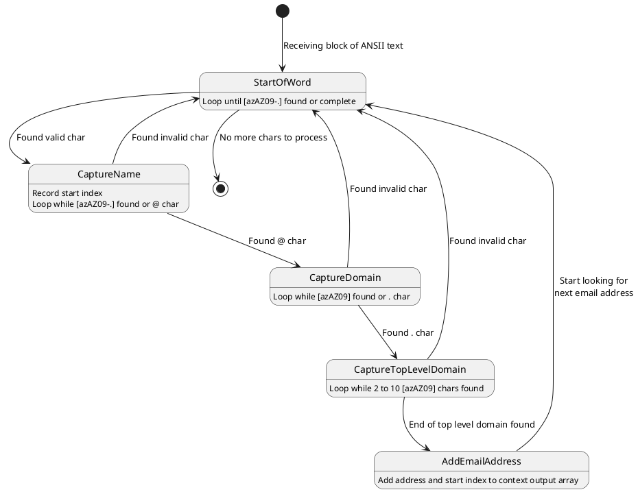

# Example Solution for SWE 1366 Honors Project
### MVC & State Machine Solution to Extract Emails From Text Blocks

Create an MVC application that:
- accepts a multiline text block in a simple browser UI,
- posts the block to a controller,
- launches a state machine to detect simple email addresses in the block,
- returns the email addresses and their start indexes to the client, and
- renders the results in the browser.

# To Execute

1. If needed, install the dotnet framework: https://dotnet.microsoft.com/download
2. Open a terminal.
3. Navigate to the `StateMachine\StateMachine.Mvc` project directory.
4. Execute the following command: `dotnet watch`. This will start the application _and_ launch a browser window.
5. Paste a block of text containing valid and invalid email addresses (per the project guidelines) into the text box, then click `Find Email Addresses`.

# Example Input

```
Valid Examples
1. Jeff-Adkisson@KSU.edu 
2. j.adkisson@KSU.edu
3. JeffAdkisson@KSU.university

Invalid Examples
1. Jeff_Adkisson@KSU.com [underscore not allowed]
2. Jeff@KSU [top level domain is required]
3. Jeff@KSU.u [top level domain must be 2-10 letters, alphanumeric]
4. JeffAdkisson@KSU.universitymail [top level domain must be 2-10 letters, alphanumeric]
5. JeffAdkisson@K_S_U.university [underscore not allowed]
```

# Example Output

``` 
Found 3 Valid Email Addresses:
 1. Jeff-Adkisson@KSU.edu, 19
 2. j.adkisson@KSU.edu, 46
 3. JeffAdkisson@KSU.university, 69
```

# Calling the State Machine

```csharp
var matches = Email.Finder.Find(model.TextToScan);
```

# State Machine Diagram 


# State Machine Class Diagram


## State Machine PlantUML

